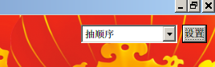
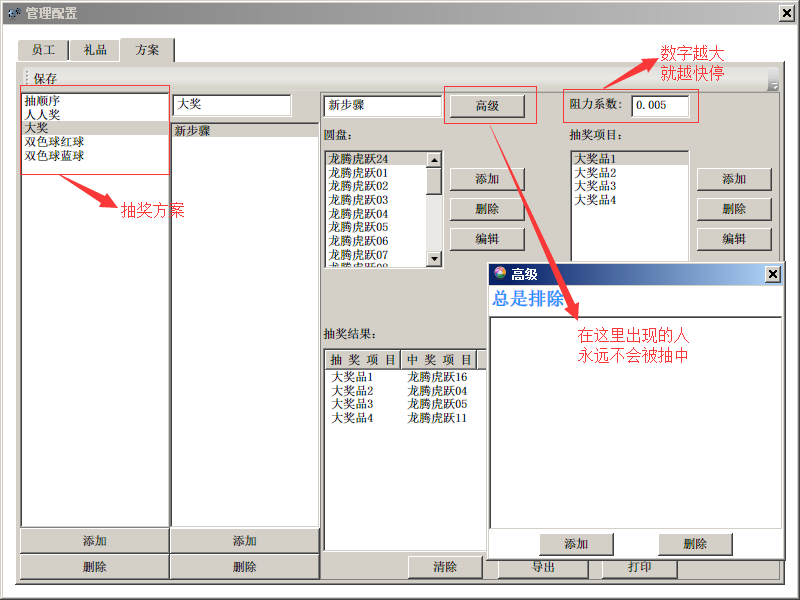

LuckyRotorPlate(幸运大转盘)
===============

## 上个效果图

## Require
* vs9+
* .net3.5+
* wpf
* C#
* NPOI
* Petzold.Text3D

## 使用

鼠标移至左上角会显示配置按钮：

设置界面如下图：

可以设置多个抽奖方案，每个方案可以设置独立的转盘和奖品；

可以让某些人永远不中奖；

可以设置转盘的速度。

## 可配置的界面

背景图、中奖指示、转盘颜色、声音等均是可配置的。

详见配置文件[app.config](./LuckyRotorPlate/app.config)
